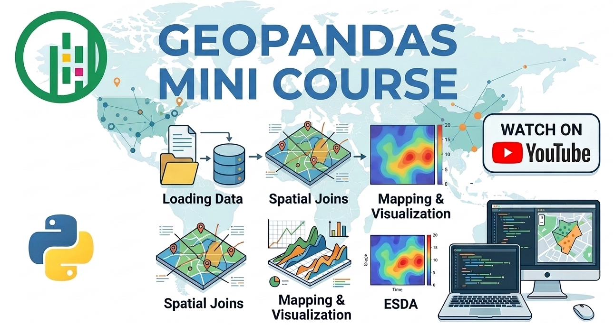

# GeoPandas Mini Course

A beginner-friendly **GeoPandas mini course** designed to teach the fundamentals of geospatial data analysis using Python.

This series walks through a complete **geospatial workflow**, from reading spatial data to performing spatial analysis and visualization.

The tutorials use **real datasets related to Egypt**

---

## What You Will Learn

- How to read geospatial datasets using GeoPandas
- Understanding common GIS file formats
- Exploring and inspecting geospatial data
- Performing geospatial transformations
- Running spatial analysis operations
- Creating clear and informative maps

---

## Course Videos and Notebooks

| Video | Topic | Notebook |
|------|------|------|
| 01 | Reading Geospatial Data | [notebook](notebooks/01_reading_geospatial_data.ipynb) |

---

###  Watch the Tutorial Videos
📺 **YouTube:**  
👉 *[[LINK]([https://youtu.be/TJ4i3amKbEw?si=RFccr6l00u4iAy-J](https://www.youtube.com/@DrNourEarthEngine))]*

---
## 👤 About the Author

**Dr. Nour Negm**  
PhD in Crop Genetics & Breeding  

Applying satellite data and open-source geospatial tools for agricultural and environmental analysis.

This repository is part of an ongoing effort to document practical, reproducible workflows that bridge academic research and real-world applications.

---

⭐ Support

If you find this repository useful:

⭐ Star the repo

📺 Subscribe to the YouTube channel

🔁 Share it with others interested in geospatial data analysis with Python
